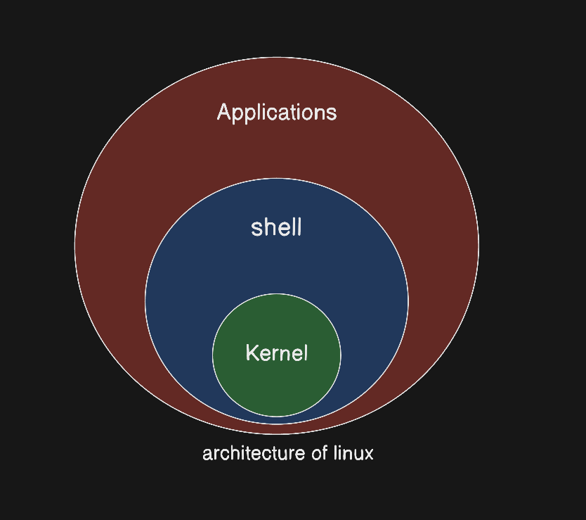
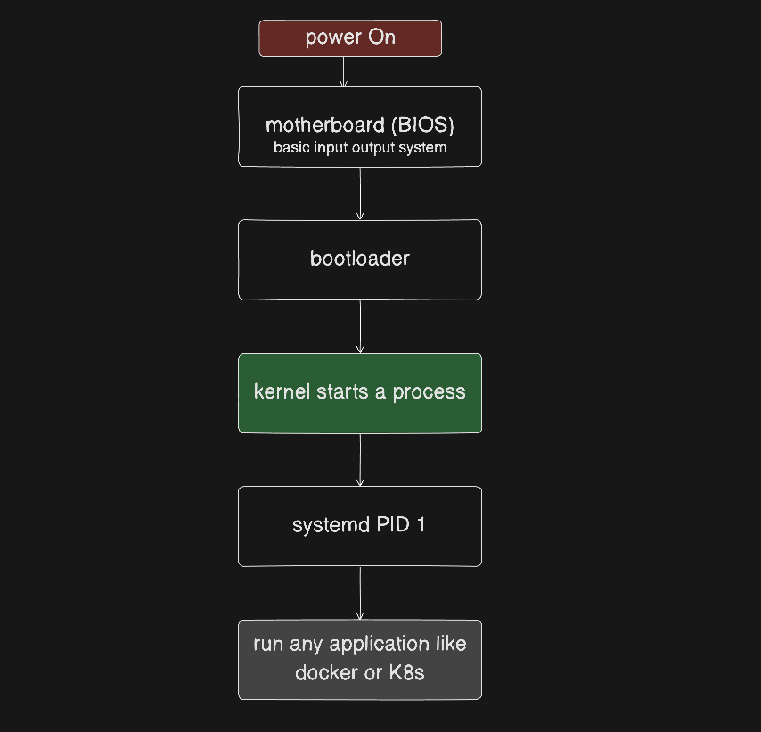
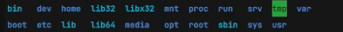

## Learning Session - 2

### What is Linux?
Linux is an Operating System.


### What is an OS?

a set of program which helps to run software on a hardware 

there are many types of OS.

1. Windows
2. MacOS
3. Linux

for mobile 
1. Android 
2. iOS 

### What are distros of linux?
- Fedora 
- Ubuntu 
- Cent OS 
- Kali Linux 
- RHEL

### why need distros ?

### History of Linux ? 

### Free vs OSS ?

### Unix vs Linux ?
macOS uses UNIX


### security issues with Windows , and security of MacOS and Linux

### Why need to learn Linux as a Devops engineer ?


### What is a server ?


### If Ubuntu is free why do we need RHEL as it is paid?

### Why there exists AWS Linux?


### Architecture Of Linux 


there are three parts


ASK
- Application - all the applications we add 
- Shell - interface to communicate with kernel in human language.
- Kernel - Core Heart of Linux

- linux kernel is written in C.


### CLI vs GUI vs Shell


### what is inside the kernel ?

### What happens when you run `echo` in the terminal internally?


### what is bin/ ? is Core/kernel precomiled


---

### What is RAM?

### What is CPU?

### What happens when you turn on a computer ?
steps ->
step 1 : power on the power supply 
step 2 : motherboard has BIOS 
step 3 : bootloader (place where linux kernel code is placed)
step 4 : kernel starts a process.
step 5 : systemd PID 1
step 6 : run any of the applications


### What is the difference between Firmware,Hardware and Software ?



### What is a BIOS ?


### What is Bootloader?


### What is a process ?

### What is systemd ?

### What is PID ?


---
### What is systemd ?

PID 1


`everything in linux is a process.`

systemd is the first process hence PID 1.


systemd - where d means daemon
daemon means background processes.


systemd starts other processes like dockerd , sshd.
docker-d -> d means daemon
ssh-d -> d means daemon

### Is terminal an Application ?


### few commands
- everything in linux is a process.
- everything in linux is a file or directory.
- everything in linux starts with /.

/ is the root directory.


```
~ which bash

/bin/bash  -> it will be printed and it shows the location of shell.

~ cd /

~ cd 

~ mkdir 

~ pwd 

~ ls

~ cd ..

~ ls -l
drwxr -> it is a directory
lrwxr -> it is a link
-rwxr -> it is a file

~ cd -> ~ reach home

~ cat etc/os-release 

~ cat

~ echo "Hello World"

~ df -h

~ free -h

~
```

there are many folders like 



bin has all the binaries

### should u make your folders and files at the root folder / & why home is the place to put those there


### Is sudo used in production ? if not why ?


### What is sudo?

### what is grep? why needed is it used in production ?

### few more commands 

```
~ mkdir demo
~ mkdir -p demo

```

- use vim to edit and then save the file.
- then show the content again.
- show just first and last line and then show first 5 and last 5 lines.

```
head hello.txt

tail hello.txt 

head hello.txt -n 5

tail hello.txt -n 5

man

```

### why /mnt directory needed?

### uname -r

### kernel -info 

### sbin
binaries are of the 2 types 
- sbin 
- bin

### What are signals in linux like SIGKILL,SIGINT ... ?

### Which signal is sent when you run kill -9 ~PID ?

SIGKIL 


### purpose of /etc/fstab


### htop & top

### you want to run a script in the background so it keeps running even if you close the terminal. which tool helps?
`nohup`

`wc -l`

- & is used to run a command in background.
### Running ubuntu on a container 

```
docker run -itd ubuntu 

docker exec -it dcb4656 bash

```
