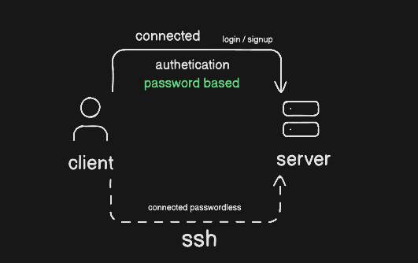
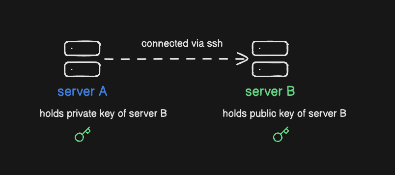

## Learning Session - 3

### What is SSH ?

### What are keys and how they work without passwords ?

### symmetric and asymmetric keys ?

### Public and Private keys ?

### ssh uses public or private keys ?

### Why named secure shell ?

it connects your shell to the shell of the other machine securely.

---

### What is Cloud n Data Centers ?

### What are cloud providers ?

### Why same compute costs different are different places ?

